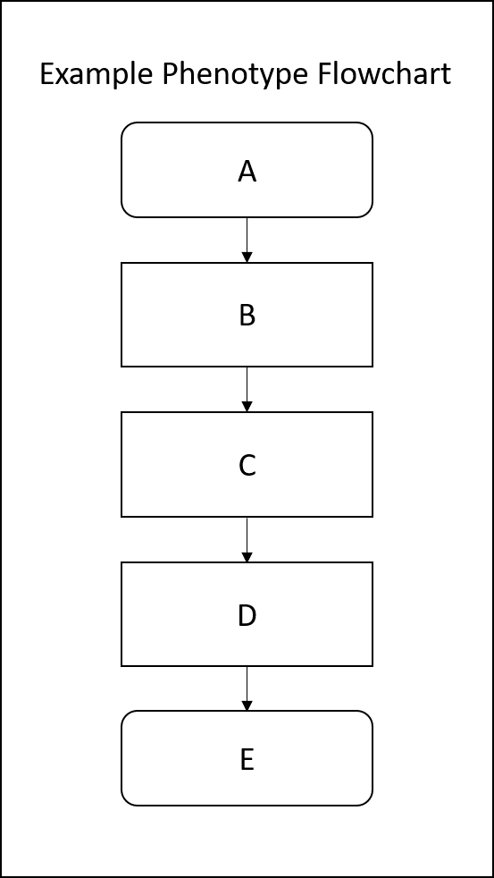

## Summary
| Characteristic | Entry |
| ------ | ------ |
| Phenotype Title | <Title> |
| Author(s) and Affiliations | <Authors_And_Affiliations> |
| Date of Submission | <Date_Of_Submission> |
| Modality | <Modality> |

## Source Data
| Link Type | Link |
| ------ | ------ |
| Phenotype GitHub Page | <Phenotype_GitHub_Page> |
| Implementation File | <Implementation_File> |
| Hash of Implementation File | <Hash> |
| Configuration File | <Configuration_File> |

## Development
### Purpose and Intended Use
<Purpose_And_Intended_Use>
### Development Methodology
<Development_Methodology>
### Additional Author Comments (if any)
<Additional_Author_Comments>

### Process Diagram / Flowchart
This may need to be left to the GitHub page...
### 

## Dependencies
### CDM-Based
**OMOP CDM Version Number: v6.0**

| Data Type | Uses? |
| ------ | ------ |
|Conditions| <Uses_Conditions> |
|Drug Exposures| <Uses_Drug_Exposures> |
|Labs| <Uses_Labs> |
|Measurements| <Uses_Notes_NLP> |
|Notes NLP| <Uses_Notes_NLP> |
|Observations| <Uses_Observations> |
|Procedures| <Uses_Procedures> |
|Visits| <Uses_Visits> |

### Demographic-Based
| Data Type | Uses? |
| ------ | ------ |
|Gender| <Uses_Gender> |
|Age Category| <Uses_Age_Category> |

### Provenance
Implementation(s) this definition was derived from or inspired by, if any:

| Definition Title | Definition Link  | Definition Hash | Provenance Reason |
| ------ | ------ | ------ | ------ |
<Provenance_Hash_Table>

### References
